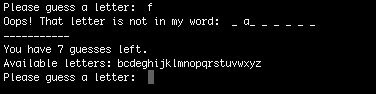

# Python Hangman

This is a simple hangman terminal game written in python. The game picks a random word from a word file and then the user picks letters they think are in that word.

1. Loading words, displaying empty spaces for letters to guess, shows all available letters, and waits for user input

2. A good letter guessed

3. A bad letter guessed

